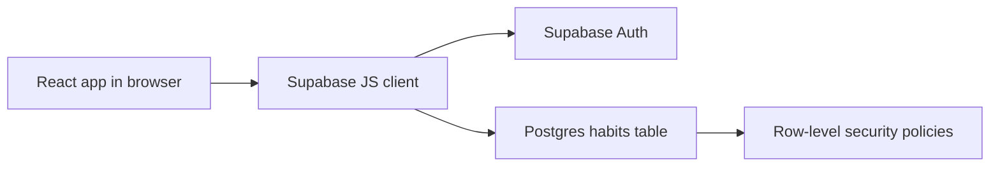

# Architecture Overview

Habit Atlas uses a React frontend and Supabase as the backend-as-a-service.

## Frontend

- React renders the login/register view and authenticated dashboard.
- `src/supabaseClient.js` reads environment variables and creates the Supabase client.
- `src/main.jsx` manages session state and CRUD operations.

## Backend/BaaS

- Supabase Auth handles registration, login, session persistence, and secure password storage.
- Supabase Postgres stores habit records.
- Row-level security ensures users cannot access another user's habits.

## Deployment

- Netlify builds the Vite app with `npm run build`.
- GitHub Actions verifies the app can build on pushes and pull requests.
- Production environment variables are configured in Netlify and GitHub repository secrets.
