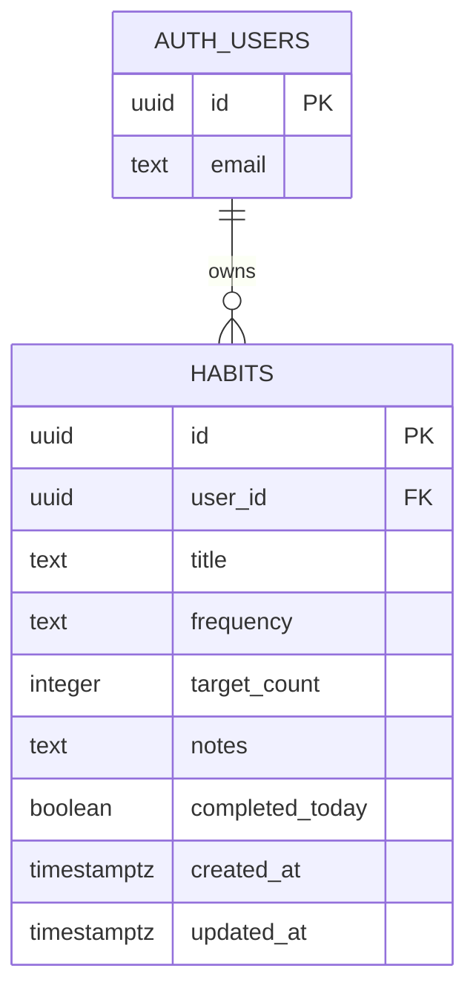

# Database Design

## ERD

## Design Decisions

- Supabase Auth owns user identity so passwords are never handled directly by the app.
- `habits.user_id` links every habit to the authenticated user.
- Row-level security protects all CRUD operations at the database layer.
- `frequency` is constrained to the three values used by the UI.
- `target_count` has a database check constraint to prevent invalid counts.
- `updated_at` is maintained by a trigger so edits are auditable.

## Permissions

The `habits` table has row-level security enabled. Policies allow a user to select, insert, update, or delete only rows where `auth.uid()` matches `user_id`.
